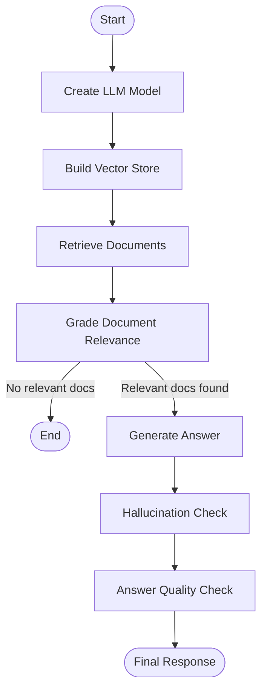

# Self-RAG from Scratch


A production-oriented, self-reflective Retrieval-Augmented Generation pipeline. Instead of stopping at retrieval and generation, it applies structured relevance grading, hallucination checks, and final answer validation before returning output.

## Problem

Traditional RAG systems often fail in predictable ways:

- Retrieval noise introduces irrelevant context
- Hallucinations appear when evidence is weak or absent
- Answer quality is inconsistent without validation gates
- Pipelines are hard to audit when execution is implicit

## Solution

This project implements a self-reflective, quality-controlled RAG workflow:

- Graph-based orchestration with LangGraph
- Structured binary graders with Pydantic (`yes`/`no`)
- Hallucination and answer-quality gates before final output
- One-command local run, Docker run, and Compose run
- Fallback runtime paths for restricted Docker hosts

### Tech Stack

| Component | Tool |
| --- | --- |
| LLM | GPT-4o-mini |
| Orchestration | LangGraph |
| Vector Store | Chroma |
| Embeddings | OpenAIEmbeddings |
| Loader | WebBaseLoader |
| Splitter | RecursiveCharacterTextSplitter |
| Structured Output | Pydantic |

### Project Structure

```text
SELFRAG-agent.py          # main graph pipeline
Prompts.py                # grader prompts
run.sh                    # unified launcher
requirements.txt          # dependencies
test_selfrag_smoke.py     # smoke tests
docker/                   # docker assets
  Dockerfile
  docker-compose.yml
  docker-compose.fallback.yml
```

## Architecture



### Core Pipeline Stages

1. Retrieve documents from configured knowledge URLs
2. Grade each document for relevance
3. Generate grounded response from filtered context
4. Grade hallucination risk
5. Grade answer relevance to user question

## Demo Command

### 1) Configure environment

Add your key to `.env`:

```env
OPENAI_API_KEY=your_key_here
```

### 2) Run (recommended local path)

```bash
chmod +x run.sh
./run.sh --local
```

### Other run modes

### Local

```bash
./run.sh --local
```

What it does:

- Creates `.venv` if missing
- Installs dependencies
- Runs smoke tests
- Runs full Self-RAG demo

### Docker

```bash
./run.sh --docker
```

What it does:

- Attempts normal Docker image build and run
- If host blocks image builds, falls back to no-build container execution

### Docker Compose

```bash
./run.sh --compose
```

What it does:

- Attempts standard compose build/run
- If host blocks build networking/mount operations, falls back to compose no-build service

### Programmatic usage

```python
from importlib.machinery import SourceFileLoader

selfrag = SourceFileLoader("selfrag", "SELFRAG-agent.py").load_module()
response = selfrag.run_self_rag("What is RAG and how does it work?")
print(response.get("generation", "No generation returned"))
```

### Testing

```bash
python -m unittest -q
```

## Results

- End-to-end runnable locally with one command (`./run.sh --local`)
- Docker and Compose paths supported, including automatic fallbacks on restricted hosts
- Smoke tests included and runnable via `python -m unittest -q`
- Deterministic control flow with explicit quality gates before final answer

## Why this matters

This project turns RAG from a simple generate pipeline into an auditable decision system. The added relevance, grounding, and quality checks reduce silent failure modes and make the architecture easier to trust, explain, and ship.

## Troubleshooting

### Missing OpenAI key

Error symptoms:

- `OPENAI_API_KEY is not set`

Fix:

```bash
export OPENAI_API_KEY=your_key_here
```

Or add to `.env`:

```env
OPENAI_API_KEY=your_key_here
```

### Docker build fails with operation not permitted

Error symptoms:

- `unshare: operation not permitted`
- `failed to mount ... buildkit-mount ... operation not permitted`

What to expect:

- `./run.sh --docker` automatically falls back to a no-build container run
- `./run.sh --compose` automatically falls back to `docker/docker-compose.fallback.yml`

### Docker Compose network creation fails

Error symptoms:

- `failed to create network ... operation not permitted`

Fix:

- Use the provided fallback compose path through `./run.sh --compose` (already handled automatically)

### Dependencies taking too long in Docker fallback

Notes:

- First fallback run installs all Python dependencies in-container and can take time
- Subsequent runs are faster due pip cache reuse in `.pip-cache`

### Verifying project health quickly

```bash
python -m unittest -q
./run.sh --local
```

## Future Extensions

- Multi-hop retrieval
- Iterative re-query loops
- Confidence scoring
- Hybrid local + remote embeddings
- Tool-calling integration
- Multi-agent RAG workflows
